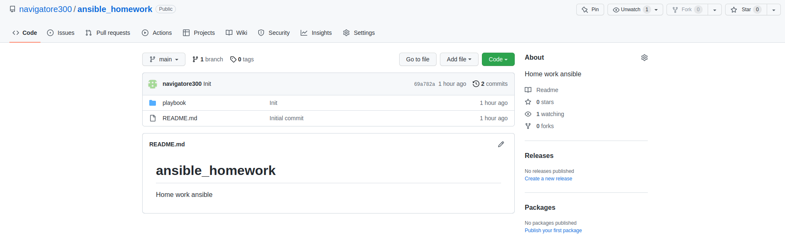

# Домашнее задание к занятию "08.01 Введение в Ansible"

## Подготовка к выполнению
1. Установите ansible версии 2.10 или выше.  
---
__Ответ:__  
```shell
ansible --version

ansible [core 2.13.2]
  config file = /etc/ansible/ansible.cfg
  configured module search path = ['/home/userr/.ansible/plugins/modules', '/usr/share/ansible/plugins/modules']
  ansible python module location = /usr/lib/python3/dist-packages/ansible
  ansible collection location = /home/userr/.ansible/collections:/usr/share/ansible/collections
  executable location = /usr/bin/ansible
  python version = 3.10.4 (main, Jun 29 2022, 12:14:53) [GCC 11.2.0]
  jinja version = 3.0.3
  libyaml = True

```
---
2. Создайте свой собственный публичный репозиторий на github с произвольным именем.
---
__Ответ:__  
[Репозиторий для ДЗ ansible ](https://github.com/navigatore300/ansible_homework)
---
3. Скачайте [playbook](./playbook/) из репозитория с домашним заданием и перенесите его в свой репозиторий.
---
__Ответ:__  

---
## Основная часть
1. Попробуйте запустить playbook на окружении из `test.yml`, зафиксируйте какое значение имеет факт `some_fact` для указанного хоста при выполнении playbook'a.  
---
__Ответ:__  
```shell
ansible-playbook site.yml -i inventory/test.yml

PLAY [Print os facts] *************************************************************************************************************************************************************************************

TASK [Gathering Facts] ************************************************************************************************************************************************************************************
ok: [localhost]

TASK [Print OS] *******************************************************************************************************************************************************************************************
ok: [localhost] => {
    "msg": "Ubuntu"
}

TASK [Print fact] *****************************************************************************************************************************************************************************************
ok: [localhost] => {
    "msg": 12
}

PLAY RECAP ************************************************************************************************************************************************************************************************
localhost                  : ok=3    changed=0    unreachable=0    failed=0    skipped=0    rescued=0    ignored=0
```
2. Найдите файл с переменными (group_vars) в котором задаётся найденное в первом пункте значение и поменяйте его на 'all default fact'.
---
__Ответ:__ 
```shell
cat ./group_vars/all/examp.yml
---
  some_fact: "all default fact"
```
3. Воспользуйтесь подготовленным (используется `docker`) или создайте собственное окружение для проведения дальнейших испытаний.  
---
__Ответ:__ 
`docker ps`

```shell
CONTAINER ID   IMAGE                      COMMAND                  CREATED          STATUS          PORTS     NAMES
8fbec0fc07b3   pycontribs/ubuntu:latest   "sh -c 'sleep 600000…"   11 minutes ago   Up 11 minutes             ubuntu
4fa410fe3136   pycontribs/fedora:latest   "sh -c 'sleep 600000…"   11 minutes ago   Up 11 minutes             fedora
a78358cf328b   pycontribs/centos:7        "sh -c 'sleep 600000…"   11 minutes ago   Up 11 minutes             centos7

```
---
4. Проведите запуск playbook на окружении из `prod.yml`. Зафиксируйте полученные значения `some_fact` для каждого из `managed host`.
---
__Ответ:__  
```shell
ansible-playbook site.yml -i inventory/prod.yml

PLAY [Print os facts] *************************************************************************************************************************************************************************************

TASK [Gathering Facts] ************************************************************************************************************************************************************************************
ok: [ubuntu]
ok: [centos7]

TASK [Print OS] *******************************************************************************************************************************************************************************************
ok: [centos7] => {
    "msg": "CentOS"
}
ok: [ubuntu] => {
    "msg": "Ubuntu"
}

TASK [Print fact] *****************************************************************************************************************************************************************************************
ok: [centos7] => {
    "msg": "el"
}
ok: [ubuntu] => {
    "msg": "deb"
}

PLAY RECAP ************************************************************************************************************************************************************************************************
centos7                    : ok=3    changed=0    unreachable=0    failed=0    skipped=0    rescued=0    ignored=0   
ubuntu                     : ok=3    changed=0    unreachable=0    failed=0    skipped=0    rescued=0    ignored=0
```
---

5. Добавьте факты в `group_vars` каждой из групп хостов так, чтобы для `some_fact` получились следующие значения: для `deb` - 'deb default fact', для `el` - 'el default fact'.
 
---
__Ответ:__  
Изменил во вложенных каталогах `deb` и `el` каталога `./group_vars/` в файлах `examp.yml`  значния `some_fact`.  


---
7. Повторите запуск playbook на окружении `prod.yml`. Убедитесь, что выдаются корректные значения для всех хостов.
---
__Ответ:__  
Получил в выводе задачи:  
```shell
TASK [Print fact] *****************************************************************************************************************************************************************************************
ok: [centos7] => {
    "msg": "el default fact"
}
ok: [ubuntu] => {
    "msg": "deb default fact"
}
```
---

7. При помощи `ansible-vault` зашифруйте факты в `group_vars/deb` и `group_vars/el` с паролем `netology`.
---
__Ответ:__ 
```shell
sudo ansible-vault encrypt group_vars/deb/examp.yml group_vars/el/examp.yml

New Vault password: 
Confirm New Vault password: 
Encryption successful

cat group_vars/{deb,el}/*

$ANSIBLE_VAULT;1.1;AES256
33333963646233303533393230646633353439373866633936613832663530326665663466656231
6563653836653261643165396133363265306562623332620a663935373235363733653430653166
64656638353733353762346265396666656333343631393336663833623232643036646161306162
3531616461333434360a396164363930646634373062303037653635663433373130376663353763
64646463356235613162363635636533373533313437636464313130356563373761393732616539
3131316331383162663431376137396161333039356435623234
$ANSIBLE_VAULT;1.1;AES256
35323865663965626439306234353034326531623433383064306565613536646139633564303266
3730636464353965643064333734333734363537373062320a653138616666316231336437393939
30663438613662613339386665626633643831313265376564396337383637666239396535663034
3566343766613563650a383263313162346238656433636666646362663938333362333632626531
32303838336263373433623534656261373566346435373230396430393762353030313661653639
6331633034323264613861653532383237666332396265623166

```
---

8. Запустите playbook на окружении `prod.yml`. При запуске `ansible` должен запросить у вас пароль. Убедитесь в работоспособности.
---
__Ответ:__
Чтобы запросил ввод с консоли:
```shell
ansible-playbook -i inventory/prod.yml site.yml --ask-vault-pass
```
Или получение пароля из файла:
```shell
ansible-playbook site.yml -i inventory/prod.yml --vault-password-file vault_password.txt
```
---
 
9. Посмотрите при помощи `ansible-doc` список плагинов для подключения. Выберите подходящий для работы на `control node`.
---

__Ответ:__  

`ansible-doc -t connection -l`  
Для Linux наверное `ssh  - connect via SSH client binary `
---

10. В `prod.yml` добавьте новую группу хостов с именем  `local`, в ней разместите localhost с необходимым типом подключения.
---
__Ответ:__  
```angular2html
cat inventory/prod.yml 
---
  el:
    hosts:
      centos7:
        ansible_connection: docker
  deb:
    hosts:
      ubuntu:
        ansible_connection: docker
  local:
    hosts:
      localhost:
         ansible_connection: local

```
---

11. Запустите playbook на окружении `prod.yml`. При запуске `ansible` должен запросить у вас пароль. Убедитесь что факты `some_fact` для каждого из хостов определены из верных `group_vars`.
---
__Ответ:__  
```angular2html
ansible-playbook site.yml -i inventory/prod.yml --vault-password-file vault_password.txt

PLAY [Print os facts] *******************************************************************************************************************************

TASK [Gathering Facts] ******************************************************************************************************************************
ok: [localhost]
ok: [ubuntu]
ok: [centos7]

TASK [Print OS] *************************************************************************************************************************************
ok: [centos7] => {
    "msg": "CentOS"
}
ok: [ubuntu] => {
    "msg": "Ubuntu"
}
ok: [localhost] => {
    "msg": "Ubuntu"
}

TASK [Print fact] ***********************************************************************************************************************************
ok: [centos7] => {
    "msg": "el default fact"
}
ok: [ubuntu] => {
    "msg": "deb default fact"
}
ok: [localhost] => {
    "msg": "all default fact"
}

PLAY RECAP ******************************************************************************************************************************************
centos7                    : ok=3    changed=0    unreachable=0    failed=0    skipped=0    rescued=0    ignored=0   
localhost                  : ok=3    changed=0    unreachable=0    failed=0    skipped=0    rescued=0    ignored=0   
ubuntu                     : ok=3    changed=0    unreachable=0    failed=0    skipped=0    rescued=0    ignored=0 
```
---

12. Заполните `README.md` ответами на вопросы. Сделайте `git push` в ветку `master`. В ответе отправьте ссылку на ваш открытый репозиторий с изменённым `playbook` и заполненным `README.md`.

## Необязательная часть

1. При помощи `ansible-vault` расшифруйте все зашифрованные файлы с переменными.
2. Зашифруйте отдельное значение `PaSSw0rd` для переменной `some_fact` паролем `netology`. Добавьте полученное значение в `group_vars/all/exmp.yml`.
3. Запустите `playbook`, убедитесь, что для нужных хостов применился новый `fact`.
4. Добавьте новую группу хостов `fedora`, самостоятельно придумайте для неё переменную. В качестве образа можно использовать [этот](https://hub.docker.com/r/pycontribs/fedora).
5. Напишите скрипт на bash: автоматизируйте поднятие необходимых контейнеров, запуск ansible-playbook и остановку контейнеров.
6. Все изменения должны быть зафиксированы и отправлены в вашей личный репозиторий.